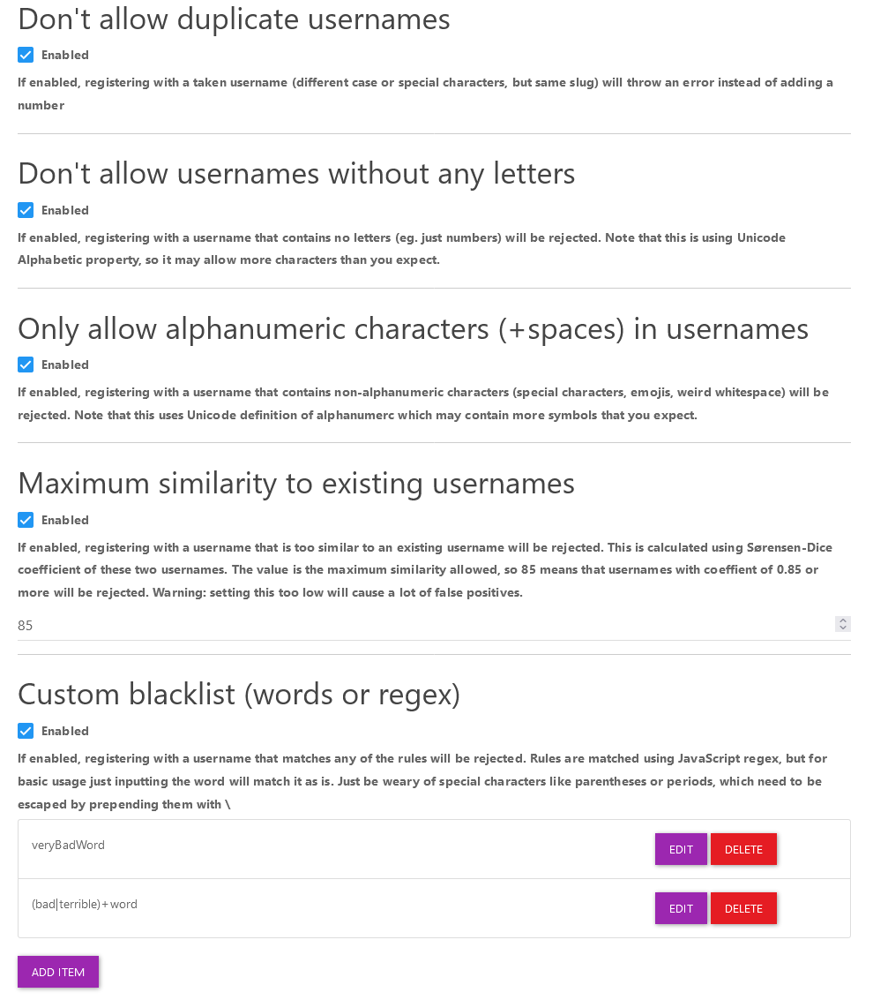

# Username Restriction Plugin for NodeBB

Set rules for what usernames are allowed on your forum

## Installation

Install via ACP or by running either
(NodeBB>2.7.0)
```bash
./nodebb install nodebb-plugin-restrict-usernames
```
or (all supported NodeBB version)
```bash
npm install nodebb-plugin-restrict-usernames
```

## screenshot
